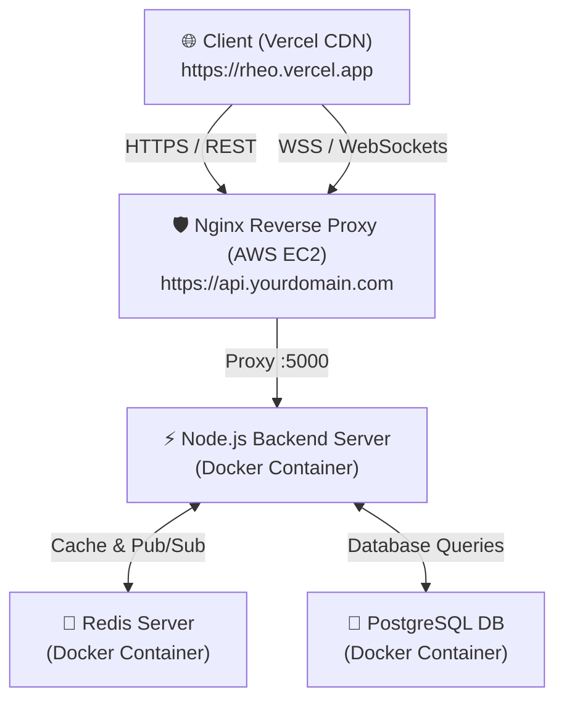

# 🚀 RHEO — Master Deployment & CI/CD Guide

Complete step-by-step production deployment guide for **RHEO Real-Time P2P File Transfer Application**.

---

## 🏗 System Deployment Architecture



- **Frontend**: Hosted on **Vercel** (Vite + React SPA) with edge distribution.
- **Backend**: Hosted on **AWS EC2** inside **Docker Containers** (Node.js + Redis + PostgreSQL + Nginx + Certbot SSL).
- **CI/CD**: Automated via **GitHub Actions** (`.github/workflows/deploy.yml`).

---

## 📋 Table of Contents

1. [Prerequisites](#1-prerequisites)
2. [Step 1: Git Push & Code Readiness](#step-1-git-push--code-readiness)
3. [Step 2: AWS EC2 Instance & Security Group Setup](#step-2-aws-ec2-instance--security-group-setup)
4. [Step 3: Domain & DNS Configuration](#step-3-domain--dns-configuration)
5. [Step 4: EC2 Server Initialization & Free SSL (Certbot)](#step-4-ec2-server-initialization--free-ssl-certbot)
6. [Step 5: Frontend Vercel Deployment](#step-5-frontend-vercel-deployment)
7. [Step 6: GitHub Actions CI/CD Setup](#step-6-github-actions-cicd-setup)
8. [Step 7: Verification & Troubleshooting](#step-7-verification--troubleshooting)

---

## 1. Prerequisites

Before starting, prepare:
- **AWS Account** (Access to EC2 & Elastic IPs).
- **Vercel Account** (Linked to GitHub).
- **Domain Name** (e.g. `yourdomain.com` from Route 53, Cloudflare, Namecheap, or GoDaddy).
- **GitHub Repository**: [`https://github.com/BugBuster18/Rheo.git`](https://github.com/BugBuster18/Rheo.git) (`v1` branch).

---

## Step 1: Git Push & Code Readiness

Ensure all latest changes are committed and pushed to GitHub:

```bash
git status
git add .
git commit -m "feat: complete deployment setup with docker & ci/cd"
git push origin v1
```

---

## Step 2: AWS EC2 Instance & Security Group Setup

### 1. Launch EC2 Instance
1. Open [AWS EC2 Console](https://console.aws.amazon.com/ec2/).
2. Click **Launch Instance**:
   - **Name**: `RHEO-Production-Server`
   - **AMI**: `Ubuntu Server 22.04 LTS (HVM), SSD Volume Type`
   - **Instance Type**: `t3.medium` (or `t3.small` / `t2.micro` for light testing)
   - **Key Pair**: Select or generate a new SSH Key Pair (`rheo-ec2-key.pem`). Save it securely.

### 2. Configure Security Group (SG) Inbound Rules
Create a new Security Group named `rheo-prod-sg` with the following inbound rules:

| Type | Protocol | Port Range | Source | Description |
|---|---|---|---|---|
| **SSH** | TCP | `22` | `0.0.0.0/0` (or My IP) | SSH terminal access |
| **HTTP** | TCP | `80` | `0.0.0.0/0` | Web & Certbot ACME challenge |
| **HTTPS** | TCP | `443` | `0.0.0.0/0` | SSL & Secure WebSockets (`wss://`) |

### 3. Allocate & Associate Elastic IP (EIP)
1. In EC2 Navigation → **Elastic IPs** → Click **Allocate Elastic IP**.
2. Click **Actions** → **Associate Elastic IP address**.
3. Choose your instance `RHEO-Production-Server` → Click **Associate**.
4. Note down your Elastic IP (e.g., `54.210.120.45`).

---

## Step 3: Domain & DNS Configuration

Go to your Domain Registrar (Route 53, Cloudflare, Namecheap, etc.):

1. Add an **A Record**:
   - **Host / Name**: `api` (or `@` if using root domain)
   - **Record Type**: `A`
   - **Value / Target**: `54.210.120.45` (Your EC2 Elastic IP)
   - **TTL**: `300` seconds (5 minutes)

*(Example Domain: `api.yourdomain.com` → `54.210.120.45`)*

---

## Step 4: EC2 Server Initialization & Free SSL (Certbot)

### 1. Connect to EC2 via SSH
```bash
chmod 400 rheo-ec2-key.pem
ssh -i rheo-ec2-key.pem ubuntu@54.210.120.45
```

### 2. Install Docker & Tools
```bash
sudo apt update && sudo apt upgrade -y
sudo apt install -y docker.io docker-compose git certbot
sudo systemctl enable --now docker
sudo usermod -aG docker ubuntu
newgrp docker
```

### 3. Clone Repository on EC2
```bash
cd /home/ubuntu
git clone https://github.com/BugBuster18/Rheo.git
cd Rheo
git checkout v1
```

### 4. Obtain Free SSL Certificate via Certbot
Run Certbot to request a free Let's Encrypt SSL certificate for your domain:
```bash
sudo certbot certonly --standalone -d api.yourdomain.com
```
*(Certificates are saved to `/etc/letsencrypt/live/api.yourdomain.com/`)*

### 5. Update Nginx SSL Domain
First change into your cloned project directory, then edit `nginx/nginx.prod.conf`:
```bash
cd ~/RHEO_   # or cd ~/Rheo
nano nginx/nginx.prod.conf
```
Replace `DOMAIN_NAME` with your actual domain (e.g. `api.yourdomain.com`).

### 6. Start Production Docker Stack
```bash
docker-compose -f docker-compose.prod.yml up -d --build
```
Verify all containers are running:
```bash
docker ps
```

---

## Step 5: Frontend Vercel Deployment

### 1. Import Project to Vercel
1. Log in to [Vercel](https://vercel.com).
2. Click **Add New** → **Project**.
3. Select `BugBuster18/Rheo` GitHub repository.
4. Set **Root Directory** to `client`.
5. Set **Framework Preset** to `Vite`.

### 2. Set Vercel Environment Variables
In Vercel Project Settings → **Environment Variables**:

| Key | Value |
|---|---|
| `VITE_API_URL` | `https://api.yourdomain.com/api` |
| `VITE_SOCKET_URL` | `https://api.yourdomain.com` |

3. Click **Deploy**. Vercel will build and assign your production frontend URL (e.g., `https://rheo.vercel.app`).

---

## Step 6: GitHub Actions CI/CD Setup

Automate zero-downtime deployments on every `git push origin v1`!

### 1. Generate SSH Deploy Key for EC2
On your local machine or EC2, generate a dedicated SSH key pair:
```bash
ssh-keygen -t ed25519 -C "github-actions-rheo" -f ~/.ssh/rheo_github_actions -N ""
```
1. Copy the **Public Key** (`~/.ssh/rheo_github_actions.pub`) and append it to EC2's `~/.ssh/authorized_keys`:
   ```bash
   cat ~/.ssh/rheo_github_actions.pub >> ~/.ssh/authorized_keys
   ```
2. Copy the entire **Private Key** (`~/.ssh/rheo_github_actions`).

### 2. Retrieve Vercel Credentials
1. **VERCEL_TOKEN**: Go to Vercel Account Settings → **Tokens** → Create Token.
2. **VERCEL_ORG_ID** & **VERCEL_PROJECT_ID**: Found in `client/.vercel/project.json` (or run `npx vercel link` inside `client/`).

### 3. Add GitHub Secrets
Go to your GitHub Repository → **Settings** → **Secrets and variables** → **Actions** → Click **New repository secret**:

| Secret Name | Value |
|---|---|
| `EC2_HOST` | `54.210.120.45` (Your EC2 Elastic IP or domain) |
| `EC2_USERNAME` | `ubuntu` |
| `EC2_SSH_KEY` | *(Contents of `rheo_github_actions` Private Key)* |
| `VERCEL_TOKEN` | *(Your Vercel Personal Access Token)* |
| `VERCEL_ORG_ID` | *(Your Vercel Org ID)* |
| `VERCEL_PROJECT_ID` | *(Your Vercel Project ID)* |

Now, whenever you run `git push origin v1`, GitHub Actions will automatically verify builds, deploy frontend to Vercel, and update backend containers on EC2!

---

## Step 7: Verification & Troubleshooting

### 1. Health Check Verification
Run on terminal or browser:
```bash
curl -i https://api.yourdomain.com/health
```
Expected Output:
```json
HTTP/1.1 200 OK
{"status":"ok","timestamp":"2026-08-18T16:50:00.000Z"}
```

### 2. View Backend Logs on EC2
```bash
docker-compose -f docker-compose.prod.yml logs -f server
```

### 3. SSL Certificate Auto-Renewal
Test automatic renewal dry-run:
```bash
sudo certbot renew --dry-run
```

---

🎉 **Congratulations! RHEO is fully deployed to production on AWS EC2 & Vercel with automated GitHub Actions CI/CD!**
